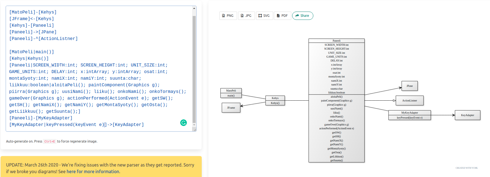
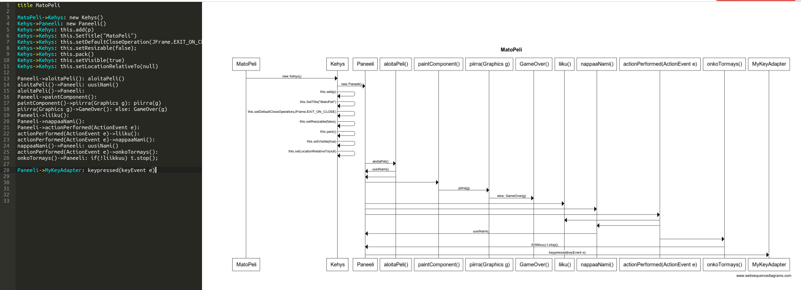

###Arkkitehtuurikuvaus

Ohjelman rakenne on aika alkeellinen. Toiminta lähtee pääluokasta, siirtyy Kehykseen ja siitä Paneeliin. 
Paneeli sisältää lähes kaiken ohjelman toiminnan eri metodeissa ja käyttää apunaan pääosin java awt:tä eikä fx:ää.

##Luokkakaavio

##Sekvenssikaavio

